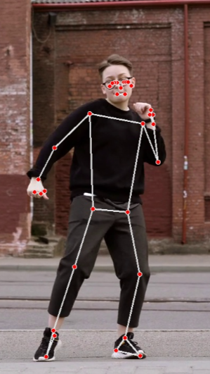
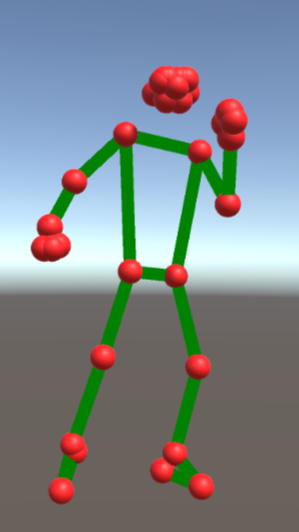

# motion_capture

    
    

## 使用方法

1. http://52.195.205.99 にアクセスします。
2. ブラウザに動画をアップロードします。
   - [_sample_videos](_sample_videos/) の動画をお使いください。
3. リアルタイムに姿勢推定の結果を表示するには「バウンディングボックスを表示」をクリックしてください。
4. CSV形式のモーションデータをダウンロードするには「モーションをダウンロード」をクリックしてください。

## 概要

このアプリケーションでは、ユーザーはブラウザを通じて動画をアップロードします。その後、サーバーサイドで動画を処理し、姿勢推定を行います。推定結果は、動画にバウンディングボックスやポイントを描画する形で再生されるか、または各関節の座標がCSV形式で保存され、クライアントに提供されます。

## 経緯

私が大学3年生の前期、PBL形式の授業で、メタバース空間で演奏セッションができるスマートフォンアプリを作ることになりました。私たちはスマートフォンの機能だけを活用してこの課題に取り組むことを決めました。そのため、アバターの動作を実現するためには、スマートフォンのカメラを使用し、モーションキャプチャを行うことが必要となりました。私はPythonを使用して、姿勢推定が可能なライブラリを探し、それを用いてプログラムを開発しました。メタバース空間内のアバターにはVRMモデルを採用することにしました。また、3D要素を主に活用するため、開発環境としてUnityを選択しました。ただし、UnityはC#を使用するため、画像処理の実装がやや難しかったため、一旦Pythonプログラムで実装し、APIを介してUnityから利用できるようにしました。

## VRMモデル

## 課題

- モーションのダウンロードをしないと、アップロードした動画が削除されない。
- ジョイント数があってない。
- 体の向きが分かりづらい。
- 座標じゃなくて回転角度が欲しい。
- Unityでの実装
